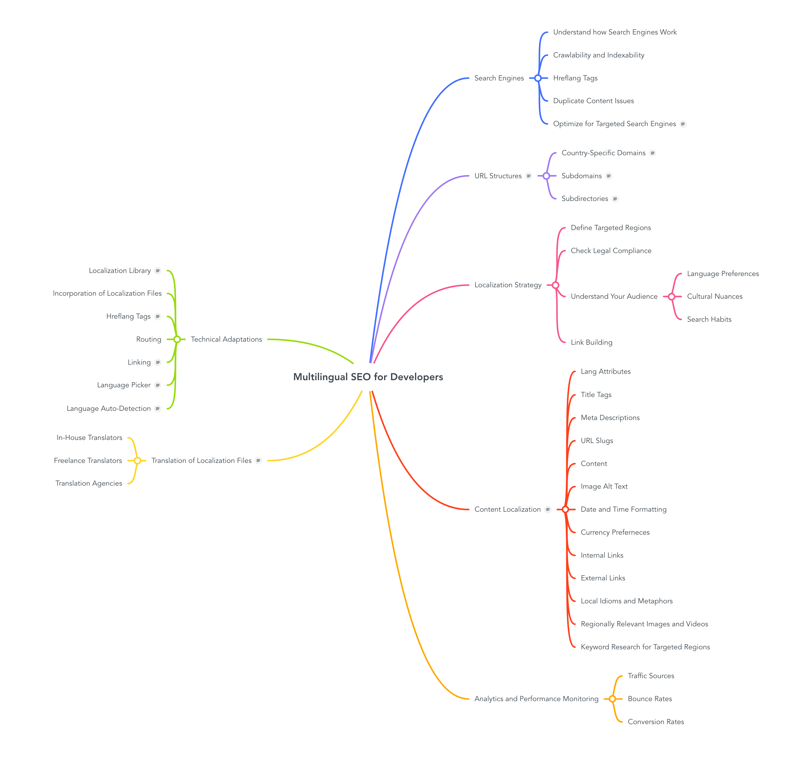

# Multilingual SEO for Developers

## Useful Links:

Below, you'll find a curated list of key resources to enhance your grasp of the concepts in this mind map and tools to streamline code adaptation checks.

### Search Engines

- [How Do Search Engines Work?](https://www.lumar.io/learn/seo/search-engines/how-do-search-engines-work/)

- [Crawlability & Indexability: What They Are & How They Affect SEO](https://www.semrush.com/blog/what-are-crawlability-and-indexability-of-a-website/)

- [Hreflang: The Easy Guide for Beginners](https://ahrefs.com/blog/hreflang-tags/)

- [Duplicate Content](https://backlinko.com/hub/seo/duplicate-content)

- [Going beyond Google: SEO on other search engines](https://digitaldot.com/seo-on-other-search-engines/)

### URL Structures

- [Using locale-specific URLs](https://developers.google.com/search/docs/specialty/international/managing-multi-regional-sites#locale-specific-urls)

### Analytics and Performance Monitoring

- [SEO Analytics: What Is It, and How Do You Track It?](https://www.seo.com/basics/analytics/)

### Technical Adaptations

- [Hreflang Generator](https://localizely.com/hreflang-generator/)

- [Hreflang Checker](https://localizely.com/hreflang-checker/)
